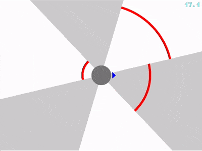

# Circles

**Circles** is a minimalist action game written purely in C. It uses geometric primitives for rendering, and all animations are computed with trigonometric functions and integral-style calculations.

You control a small triangle navigating through rapidly rotating obstacles—your goal is to survive as long as possible without touching the red arcs.

<p align="center">
  
</p>

---

## 🔧 Dependencies

- **SDL2** library — [https://www.libsdl.org/](https://www.libsdl.org/)

- Supported Platforms are **Unix based systems**, MacOS and Linux.

---

## 🚀 Build & Run

### Build

From the project root directory:

```bash
cd src
make
```

### Run

```bash
./circles
```

---

## 🎮 Gameplay & Controls

### Menu Navigation

- ← / → : Move cursor
- ⏎ (Enter) : Select

### In-Game

Use ← / → to rotate the triangle around the circle

#### Difficulty Levels

- **Easy** — relaxed speed and wide gaps
- **Medium** — balanced challenge
- **Hard** — fast rotations and narrow gaps


