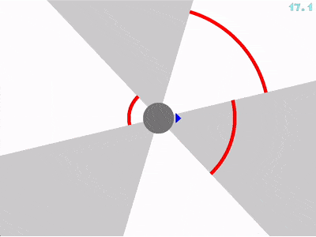

# Circles

**Circles** is a minimalist action game written purely in C. It uses geometric primitives for rendering, and all animations are computed with trigonometric functions and integral-style calculations.


<p align="center">
  
</p>

---

## Dependencies

- **SDL2** library - [https://www.libsdl.org/](https://www.libsdl.org/)

- Supported Platforms are **Unix based systems**, MacOS and Linux.

---

## Build & Run

### Build

From the project /src directory:

```bash
make
```

### Run

```bash
./circles
```

---

## Gameplay & Controls

You control a small triangle navigating through rapidly rotating obstacles, your goal is to survive as long as possible without touching the red arcs.

### Menu Navigation

- ← / → : Move cursor
- ⏎ (Enter) : Select

### In-Game

Use ← / → to rotate the triangle around the circle

#### Difficulty Levels

- **Easy** - relaxed speed and wide gaps
- **Medium** - balanced challenge
- **Hard** - fast rotations and narrow gaps


